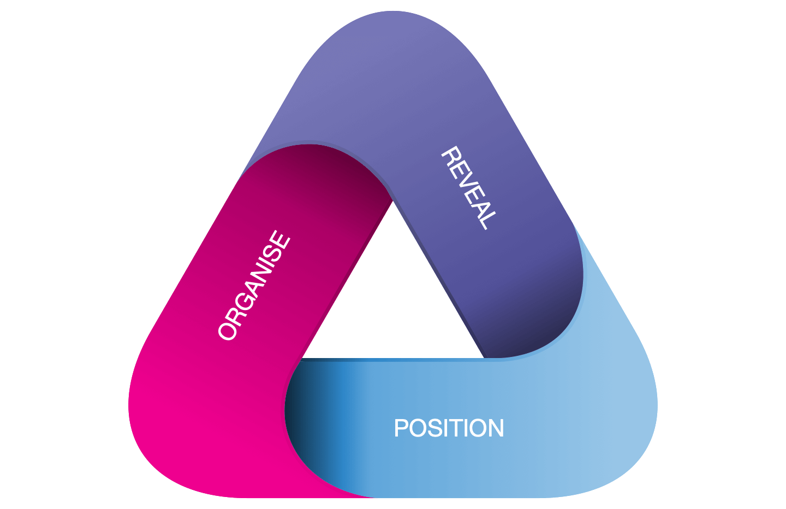

[Design Thinking](https://en.wikipedia.org/wiki/Design_thinking) draws from the designer's toolbox for non-typical design contexts. When applied to innovation, it combines [exploring problems, building empathy and prototyping solutions](https://en.wikipedia.org/wiki/Design_thinking#As_a_process_for_innovation). This combination maps well to the practical challenges in platforming:

{:data-width="600" data-height="398"}

* [Reveal]{:.heading.flip-title} the ecosystem to design for. Build understanding of people, organisations and things acting in context. Gather new and compelling perspectives on needs and expectations,
* [Position]{:.heading.flip-title} your organisation in the ecosystem. Start facilitating  coordinated value exchanges and let the ecosystem leverage its true potential. Capture these statements in a platform model,
* [Organise]{:.heading.flip-title} for the minimum viable platform experience. Deconstruct the platform model into enough interventions to validate the organisation's position in the ecosystem.
{:.related-posts.faded}

These are not mere steps or phases: they are [systems](https://www.wordnik.com/words/system) in their own right. Each is wholly complementary and sets clear boundaries to the others. Not even trying to atom-smash them into a single (convoluted, confused) model is a discerning aspect of the framework. 

[reveal]: install.md
[position]: install.md
[organise]: install.md

## Infinite Iteration

FAST is infinitely iterative. From exploring a fuzzy hunch of opportunity all the way to running a viable platform organisation—round and round and round. It captures the deliberately repeating behaviours of organisations responding to ecosystem dynamics:

{:data-width="600" data-height="398"}

Revealing the ecosystem *frames* the organisation's future position. This position challenges the existing organisation to adapt and learn from new, revealed versions of the ecosystem. Round and round and round. 
