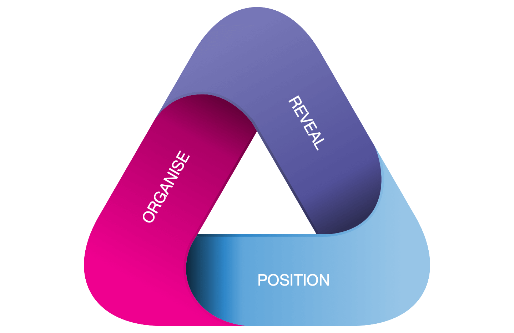
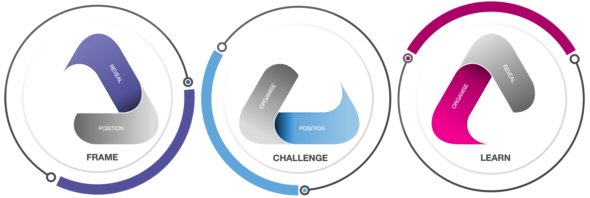

Ecosystem innovation has all the makings of a [wicked problem](https://en.wikipedia.org/wiki/Wicked_problem). 
FAST draws from Design Thinking as a collaborative way of coping with such problems. *Thinking as a designer* implies immersion in a situation, building shared understanding and prototyping solutions. 
This combination gives way to the three components of FAST:

{:data-width="600" data-height="398"}

* [Reveal]{:.heading.flip-title} the ecosystem to design for. Build understanding of people, organisations and things acting in context. Gather new and compelling perspectives on needs and expectations,
* [Position]{:.heading.flip-title} your platform in the ecosystem. Understand facilitating  coordinated value exchanges and let the ecosystem leverage its true potential. Capture these statements in a platform model,
* [Organise]{:.heading.flip-title} for the minimum viable platform experience. Deconstruct the platform model into enough interventions to validate the organisation's position in the ecosystem.
{:.related-posts.faded}

[reveal]: reveal.md
[position]: position.md
[organise]: organise.md

These are not mere steps or phases: they are *toolkits* in their own right. Each is wholly complementary and sets clear boundaries to the others. 
This also allows them to leverage different and well-established disciplines: 

* [Strategic Design] to reveal (latent resources and capabilities, and emergent trends and forces),
* [Service Design] to position (a perspective with qualitative research and ideation techniques),
* [Customer Development] to organise (solutions in search of a repeatable and scalable business).

[Strategic Design]: https://en.wikipedia.org/wiki/Strategic_design
[Service Design]: https://en.wikipedia.org/wiki/Service_design
[Customer Development]: https://en.wikipedia.org/wiki/Customer_development

 Not even trying to atom-smash these into a single (convoluted, confused) model is a discerning aspect of the framework, for sure. 

## Infinite Iteration

FAST is infinitely iterative.
It captures the deliberately repeating behaviours of organisations responding to ecosystem dynamics. 
From exploring a fuzzy hunch of opportunity, to running a viable platform organisation and back to exploring. 🔄 Round and round and round:

{:.lead data-width="600" data-height="398"}

Revealing the ecosystem *frames* the platform's future position. This position challenges the existing organisation to adapt and learn from new, to be revealed versions of the ecosystem. 

🔄 Round and round and round. 
