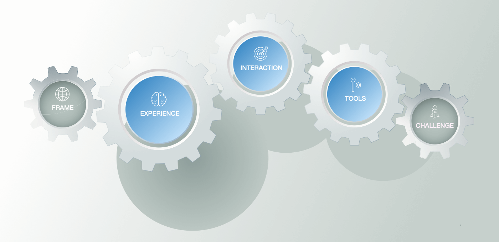

The FAST Position tool is build around a structured platform model. This model captures *intended* 🗺 outcomes and the platform's support for participants *converging* 📍on these. 

The takes its core structure from the [Tools-Rules-Interaction-Experience](http://platformed.info/the-trie-framework-platforms/) framework: 

{:.lead data-width="600" data-height="398"}

The tool expands on this framework with **Frame** and **Challenge**. These capture the output from the [Reveal] tool and the input to the [Organise] tool, respectively. The latter addition also turns the model into a great tool for deciding on what, where and when to build and test next 🗓. 

[Reveal]: reveal.md
[Organise]: organise.md

**Note 1.** It is indeed a (dynamic 🚀) model and not a (static 🏔) plan: it describes the interplay between outcomes and support structures. 
{:.message}

**Note 2.**: The Mechanics-Dynamics-Aesthetics [games framework](https://en.wikipedia.org/wiki/MDA_framework) describes the structure and interplay comparable to TRIE.
{:.message}

**Note 3.**: The application of 'design' to ecosystem innovation is somewhat of an oxymoron. The designer cannot know upfront of all challenges that will confront individual participants. The full flow of events in response to any of these challenges is likewise not planned in advance.
{:.message}

<a class="btn btn-primary" href="https://f-a.link/pps">Download the Tool</a> <a class="btn btn-primary" href="https://position.futuring-architectures.com">Read the Online Manual</a>
