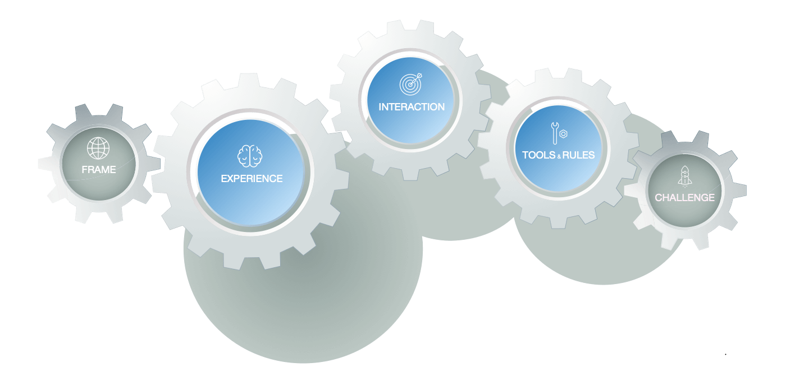

Designing a platform business model is somewhat oxymoronic. A designer cannot fully know nor control upfront what challenges will confront participants. The flow of events in response to these challenges are not planned in advance, but emerge from interactions with the ecosystem. 

In FAST, a platform model 🗺 captures *intended* outcomes and the platform's support for participants *converging* on these. It is a (dynamic) model and not a (static) plan: its explicit purpose is to describe the interplay between key platform aspects. 

{:.lead data-width="600" data-height="398"}

The model takes its core from the [Tools-Rules-Interaction-Experience](http://platformed.info/the-trie-framework-platforms/) framework---the benchmark for capturing platform mechanics. 

FAST expands on this framework with *Frame* and *Challenge* aspects. These help in setting clear and tangible definitions of both context and goal. They also turn the model into a great tool for deciding on what, where and when to build and test next.

<a class="btn btn-primary" href="https://position.futuring-architectures.com">Read the Position Manual</a>
